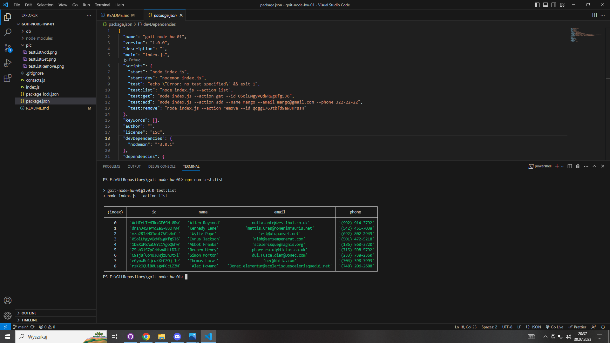
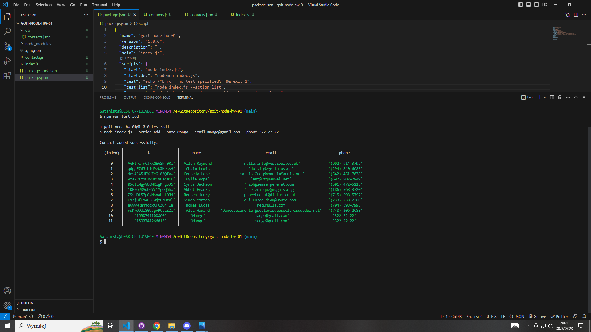

# CLI Application - Homework

## Description

This is a Command Line Interface (CLI) application designed as a simple contacts management system. The application allows users to interact with a contact list by performing various actions, such as listing all contacts, adding a new contact, getting a contact by its ID, and removing a contact from the list.

The application is built using Node.js and utilizes the fs module for file system operations, enabling contacts to be stored in a JSON file. It also leverages the popular yargs library for parsing command-line arguments, making it easy and intuitive for users to interact with the application through the terminal.

## Getting Started

To run the application, follow these steps:

1. Clone the repository to your local machine.

2. Navigate to the project directory in the terminal.

3. Install the required dependencies by running:
   ```bash
   npm install
   ```

## List

- **List Contacts**: To view all the contacts in the contact list, use the following command:
  ```bash
  npm run test:list


## Get

- **Get Contact by ID**: To retrieve a specific contact by providing its unique ID, use the following command:
   ```bash
   npm run test:get


## Add

- **Add New Contact**: To add a new contact to the contact list, use the following command:
   ```bash
   npm run test:add


## Remove

- **Remove Contact**: To delete a contact from the contact list by specifying its unique ID, use the following command:
   ```bash
   npm run test:remove

